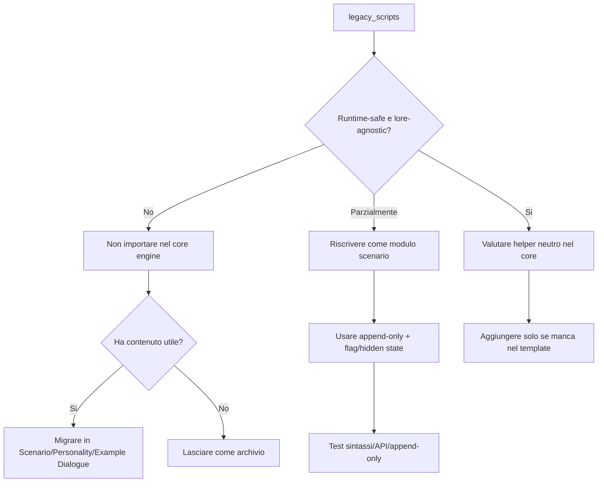

# Piano — Analisi importabilità legacy_scripts nel core engine

## Summary

Obiettivo: valutare se gli script in `1_template/legacy_scripts` siano importabili, anche solo in parte, dentro il core engine `1_template/SvartulfrVerse_Engine_Template.js` e l’export runtime `2_Export/SvartulfrVerse_Engine.js`.

Decisione preliminare: **non importare wholesale i legacy scripts nel core engine né nell’export**. Alcuni contenuti sono recuperabili, ma solo come linee guida, direttive scenario o moduli riscritti. Il core engine deve restare lore-agnostic e deve usare solo `context.character.personality`, `context.character.scenario`, `context.character.example_dialogs` per la persistenza.

## Current State Analysis

### Architettura runtime attuale

Il core template dichiara esplicitamente di essere lore-agnostic e limitato a stato visibile, hidden state, progressive context, debug e token budget, senza API hard-blocked: SvartulfrVerse_Engine_Template.js.

Il template inizializza e protegge `context.character.personality`, `scenario` ed `example_dialogs` subito dopo il guard su `context`: SvartulfrVerse_Engine_Template.js.

Il pattern di scrittura sicuro è append-only tramite helper `appendIfMissing`: SvartulfrVerse_Engine_Template.js.

Le regole runtime confermano che solo `personality`, `scenario` ed `example_dialogs` sono campi passati back al model: 03_runtime_context_api.md.

Le regole architetturali vietano al Level 0 di gestire lore, world facts, family genealogy, scenario-specific canon, magic, technology o faction rules: 07_templates_architecture.md.

### Stato dell’export

L’export è più snello del template: ha il guard su `context.character` e le utility base, ma non include NPC core, relationship core, anti-omniscience, time delay, world engine o scenario engine: SvartulfrVerse_Engine.js.

Conclusione operativa: l’export non dovrebbe essere patchato direttamente con blocchi legacy. Se serve aggiungere runtime features, prima va allineato al template master, poi eventualmente si valutano moduli scenario-specific fuori dal Level 0.

## Importability Matrix

| File legacy | Valutazione | Motivo principale | Destinazione corretta |
|---|---:|---|---|
| `Betteresponses.js` | Parzialmente importabile come contenuto | Ha errori di sintassi e usa assegnazioni/duplicazioni; utile come anti-cliché writing guide | Personality/Scenario/Example Dialogue |
| `ChatbotRulesRoleplayGuidelines.js` | Parzialmente importabile come contenuto | È un array di linee guida, non un runtime script autonomo | Scenario/Personality/Example Dialogue |
| `slowburn.js` | Parzialmente importabile dopo riscrittura | Pacing utile, ma scrive su `context.character.lorebook` e non ha guard/metadata | Scenario relationship/pacing |
| `state_engine.js` | Parzialmente importabile dopo riscrittura | Usa `context.variables` non persistente e ha `inject` non dichiarato | Scenario state module o HUD/flag |
| `relationship_engine.js` | Parzialmente importabile dopo riscrittura | Usa `context.variables`, debug injection e ridefinisce family dynamic | Scenario relationship module |
| `En_Core.js` | Non importabile wholesale | Lore-specific, usa `context.variables`, `context.world`, `context.flags`, resetta scenario e duplica il template | Solo idee generiche, se necessarie, da riscrivere |
| `Absolute_RP_Core.js` | Non importabile wholesale | Meccaniche utili ma token-heavy, lore-specific, usa `context.variables`, contenuto esplicito e HUD emoji | Scenario optional mechanics, solo se richiesto |
| `lorebook_template.js` | Non importabile wholesale | Sovrapposto al World template, usa `context.variables` e placeholder | World lorebook o scenario lore dynamic |
| `scenario_engine.js` | Non importabile | File vuoto | Nessuna |
| `emotion_engine.js` | Non importabile | File vuoto | Nessuna |
| `family_engine.js` | Non importabile | File vuoto | Nessuna |
| `pack_engine.js` | Non importabile | File vuoto | Nessuna |
| `trust_engine.js` | Non importabile | File vuoto | Nessuna |

## Key Evidence

### Vincoli che bloccano importazione diretta

- `Betteresponses.js` contiene backtick non chiusi e virgolette tipografiche: Betteresponses.js, Betteresponses.js, Betteresponses.js.
- `slowburn.js` scrive su `context.character.lorebook`, che non è un campo persistente scrivibile: slowburn.js.
- `state_engine.js` usa `inject +=` senza dichiarare `inject`, quindi può causare `ReferenceError`: state_engine.js.
- `state_engine.js` dipende da `context.variables` per emotion, scenario, pack status e current role: state_engine.js, state_engine.js, state_engine.js.
- `relationship_engine.js` usa `context.variables` per trust, relationship, attraction e family dynamic: relationship_engine.js, relationship_engine.js.
- `En_Core.js` assegna `context.world` e `context.flags`, non campi runtime persistenti: En_Core.js.
- `En_Core.js` usa `context.variables` per multiverse gatekeeping e stato runtime: En_Core.js, En_Core.js.
- `En_Core.js` resetta `context.character.scenario`, violando append-only e rischiando di cancellare lo scenario del bot: En_Core.js.
- `En_Core.js` contiene lore world-specific e riferimenti a Douglas, Solarton, Bloodmoon, Ambrosia, Los Angeles, Jarn e altri: En_Core.js, En_Core.js.
- `En_Core.js` sostituisce completamente `context.character.scenario` con direttive statiche: En_Core.js.
- `Absolute_RP_Core.js` usa `context.variables` per vitals/HUD e narrativa: Absolute_RP_Core.js, Absolute_RP_Core.js, Absolute_RP_Core.js.
- `Absolute_RP_Core.js` include direttive lore-specific come Douglas protocol e travel/fatigue protocol: Absolute_RP_Core.js.
- `lorebook_template.js` usa `context.variables.activeCharacter` e contiene placeholder generici: lorebook_template.js, lorebook_template.js.

## Proposed Changes

### 1. Non concatenare `legacy_scripts` nel core engine

Non aggiungere `legacy_scripts` a SvartulfrVerse_Engine_Template.js né a SvartulfrVerse_Engine.js tramite concatenazione diretta.

Motivo: il core engine è Level 0 e deve restare lore-agnostic. `En_Core.js`, `Absolute_RP_Core.js` e `lorebook_template.js` introducono lore, meccaniche scenario-specific, campi non persistenti e istruzioni token-heavy.

### 2. Non patchare direttamente l’export con blocchi legacy

Prima di qualsiasi integrazione runtime nell’export, allineare SvartulfrVerse_Engine.js al template master. L’export attuale manca di sezioni già presenti nel template, quindi una patch legacy produrrebbe un runtime ibrido e meno sicuro.

### 3. Migrare contenuti non-runtime in Level 3

Trasferire manualmente solo le parti testuali utili:

- anti-cliché e varietà narrativa da `Betteresponses.js` in Personality/Scenario/Example Dialogue;
- GM contract, agency, pacing e formatting da `ChatbotRulesRoleplayGuidelines.js` in Scenario;
- slow burn stages da `slowburn.js` in `RELATIONSHIP_STATE` / `DYNAMIC_BEHAVIORS` / `PACING & STYLE`.

Queste migrazioni devono essere compatte, senza lore dump e senza duplicare contenuto già presente nella card.

### 4. Riscrivere eventuali state/relationship mechanics fuori dal core engine

Se l’utente vuole conservare state/relationship mechanics, creare un modulo scenario-level o direttive Scenario che:

- non usi `context.variables`;
- non scriva su `context.character.lorebook`;
- non ridefinisca genealogy/family authority;
- usi append-only su `personality`, `scenario` o `example_dialogs`;
- persista tramite flag visibili, hidden state zero-width, HUD compatti o progressive context;
- includa metadata `source` e `Canon Layer` quando diventa lorebook voice.

### 5. Estrarre solo meccaniche neutre da Absolute/En_Core se davvero richieste

Valutare solo dopo approvazione esplicita:

- weather/atmospheric backdrop;
- vitals compatti;
- travel/fatigue reminder;
- diegetic communication format.

Queste devono essere neutralizzate, abbreviate e spostate a scenario-level. Non devono contenere Douglas, Bloodmoon, Solarton, Los Angeles, Jarn, pack lore, NSFW gate espliciti o HUD emoji.

### 6. Lasciare `legacy_scripts` come archivio storico

Non modificare o cancellare i file legacy in questa fase. Trattarli come archivio di pattern e direttive, non come base runtime da importare.

## Assumptions & Decisions

- “Importabile” significa: codice che può essere aggiunto al runtime senza violare Level 0, sandbox ES6-safe, context API e append-only rule.
- “Parzialmente importabile” significa: solo contenuto o logica neutra può essere recuperata dopo riscrittura; il file originale non va concatenato.
- Il core engine resta Level 0 lore-agnostic.
- Il World integrated lorebook resta la fonte per MacroCosmo/MicroCosmo.
- Scenario e bot card restano il posto corretto per pacing, relationship state, output voice e direttive narrative.
- `context.variables`, `context.character.lorebook`, `context.world` e `context.flags` non devono essere usati per persistenza runtime.
- Se si modifica l’export, va generato/allineato dal template master, non patchato manualmente con frammenti legacy.

## Recommended Flow

## Verification Steps

Dopo approvazione del piano e passaggio all’esecuzione:

1. **Static syntax check**
   - Eseguire `node --check` sui candidati runtime prima di ogni modifica.
   - Bloccare qualsiasi file con errori di sintassi.

2. **Forbidden API scan**
   - Cercare `async`, `await`, `Promise`, `fetch`, `require`, `import`, `window`, `document`, `setTimeout`, `setInterval`, `Object.defineProperty`.
   - Cercare `context.variables`, `context.character.lorebook`, `context.world`, `context.flags`.

3. **Append-only scan**
   - Verificare che non ci siano assegnazioni dirette a `context.character.personality`, `context.character.scenario` o `context.character.example_dialogs`, salvo pattern esplicitamente controllati dal template.

4. **Mock runtime test**
   - Eseguire candidati con `context` mancante, `context.character` mancante, `context.chat` mancante e alias chat diversi.
   - Verificare che lo script non crashi e scriva solo nei tre campi consentiti.

5. **Token economy check**
   - Stimare token aggiuntivi.
   - Rimuovere o comprimere direttive che non cambiano comportamento, voice, pacing, gating o prevenzione failure mode.

6. **Diff hygiene**
   - Verificare `git diff --check`.
   - Confermare che l’export sia coerente con il template master dopo ogni modifica.

## Acceptance Criteria

- Nessun legacy script viene importato wholesale nel core engine.
- Nessun contenuto lore-specific entra nel Level 0.
- Nessun runtime modificato usa `context.variables` per persistenza.
- Nessun runtime modificato scrive fuori da `personality`, `scenario`, `example_dialogs`.
- Eventuali direttive scenario sono compatte, append-only e prive di duplicazioni.
- Export e template restano allineati.
