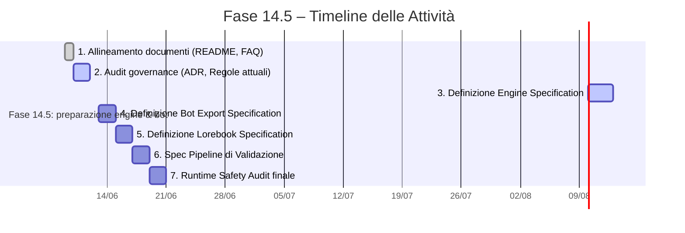

# Sommario Esecutivo

I *lorebook* (o *script*) in JanitorAI fungono da banca dati di conoscenza addizionale: ogni voce associa parole chiave (trigger) a contenuti descrittivi, permettendo di inserire informazioni pertinenti nel prompt in base al contesto. Questo meccanismo ricorda il *retrieval-augmented generation* (RAG), dove il modello consulta una fonte esterna per migliorare accuratezza e coerenza della risposta. Per l’integrazione con bot esterni (ad esempio SillyTavern o interfacce generiche JSON), è necessario definire formati di export/import standardizzati, mantenere la tracciabilità delle fonti canoniche, e applicare controlli automatici di validazione. In linea con le regole R-007/R-008/R-009 di governance, tutti i contenuti generati devono derivare da lore canonici e riportarne l’attribuzione, evitando qualsiasi inserimento arbitario o contraddittorio.

# Specifiche Consigliate

## 1. Struttura del Lorebook Interno

- **Formato dati**: Si raccomanda un formato JSON/YAML interno, strutturato come una lista di voci. Ogni voce deve contenere almeno: 
  - **Titolo/ID** (stringa univoca, es. nome o descrizione breve)
  - **Attivatori** (lista di parole o frasi chiave che attivano la voce)
  - **Contenuto** (testo descrittivo o narrativo da iniettare nel prompt)
  - **Metadati** (tag, layer canonico come *storico/culturale/attivo*, priorità, riferimenti alle fonti canoniche)
  - **Abilitazione** (flag on/off) – per disattivare voci deprecated.  
- **Categorie e Tag**: Aggiungere campi tassonomici es. *categoria*, *layer canonico* (ad es. “attivo”, “storico”, “culturale”) per consentire il filtraggio nel motore di estrazione.  
- **Campi di attributo**: Campo “Fonte” o “Citazione” (URL o ID di risorse canoniche) per tracciare la provenienza. Ciò supporta la regola di attribuzione (R-009).  

## 2. Motore di Recupero (Engine) – `ENGINE_SPECIFICATION.md`

- **Query/Recupero**: L’engine (En_Core e motori settoriali come *family_engine*, *experience_engine*, ecc.) riceve il prompt utente + ID personaggio e ricerca parole chiave nelle voci del lorebook. Usa algoritmi di ricerca basati su corrispondenza esatta o semantica (embedding).  
- **Inserimento Contestuale**: Una volta trovata la voce pertinente, l’engine decide come inserire il contenuto nel prompt (prefisso, suffisso, o prossimità chiave) mantenendo la coerenza narrativa. Deve rispettare le regole di *separazione run-time*: l’engine non genera nuovi contenuti, ma si limita a pescare e iniettare conoscenza predefinita.  
- **Validazione Interna**: Prima di restituire il frammento, l’engine controlla che la voce sia abilitata, conforme al livello canonico richiesto e non contraddica i metadati (es. non usare voci dismesse). In caso di ambiguità di trigger, possono essere applicate priorità definite nei metadati.  
- **Interfacce**: Definire API REST o di altro tipo in `ENGINE_SPECIFICATION.md` che espongono funzioni quali `getLoreEntries(query, context)` e `injectLore(prompt, entries)`. Specificare formati di input/output (JSON) con campi: prompt, personaggio, array di parole chiave attivate, testo restituito.  
- **Sicurezza**: Impedire che l’engine inietti contenuti fuori dal dominio canonico. Deve generare log di tracciamento contenenti gli ID delle voci usate, così da risalire alla fonte nel database.

## 3. Schema di Export dei Bot – `BOT_EXPORT_SPECIFICATION.md`

- **SillyTavern (ST)**: Lo schema di lorebook di SillyTavern (detto “World Info”) è un JSON con campi tipici:  
  - `name` (titolo della voce),  
  - `key` (lista parole chiave),  
  - `content` (testo),  
  - `priority` (intero per controllo ordine),  
  - `never_include` (boolean),  
  - eventuali macro per posizionare il contenuto (ad es. `prefix`/`postfix`).  
- **JanitorAI**: Non essendo prevista esportazione diretta, conviene standardizzare in un JSON “intermedio” che riproduce i campi essenziali (vedi tabella di mapping sotto).  
- **JSON generico**: Proporre un formato universale che altri bot possano usare: ad es.  
  ```json
  {
    "title": "Compleanno di Alice",
    "keywords": ["compleanno", "festa"],
    "text": "Alice compie gli anni a Londra...",
    "tags": ["memoria_personale", "evento"],
    "source_id": "C_Alice_001",
    "category": "Storico"
  }
  ```  
- **Mappatura Campi**: Mappare ogni campo di JanitorAI allo schema target. Ad es.: JanitorAI “Trigger Words” → SillyTavern `key`; “Description” → `content`; “Tags” → `tags` o `category`. Vedi tabella sottostante.

## 4. Struttura del Lorebook Esportato – `LOREBOOK_SPECIFICATION.md`

- **Formato File**: Utilizzare JSON (estensione `.json`) o YAML (`.yml`), ben documentato. Includere intestazione con metadata del lorebook (autore, data, versione, descrizione).  
- **Nome e Descrizione**: Campi globali: `lorebook_name`, `description`, `canonical_layer` (es. “base”, “storia”), `author`, `last_updated`.  
- **Voci (entries)**: Array di oggetti con i campi descritti nel punto 1.  
- **Attributi di Strutturazione**: Prevedere un campo facoltativo `children`/`subentries` se serve gestire voci gerarchiche (es. famiglie genealogiche).  
- **Tag di Validazione**: Integrare un campo come `validation_checksum` o `uuid` per ogni voce, così da verificare l’integrità del file durante il pipeline.

## 5. Pipeline di Validazione – `VALIDATION_PIPELINE_SPECIFICATION.md`

- **Controlli di Consistenza**:  
  - **Completezza**: Verificare che nessun campo richiesto sia vuoto.  
  - **Formato e Schema**: Convalidare il JSON/YAML contro uno schema definito (p.e. JSON Schema) per tipi e pattern (es. parole chiave non vuote, testo min/max).  
  - **Unicità**: Assicurarsi che i trigger di voci differenti non generino conflitti non voluti (uso di chiavi esclusive).  
- **Tracciabilità**: Ogni voce in output deve includere riferimento al record canonico originale. Il pipeline verifica che per ogni `source_id` esista effettivamente una voce corrispondente nel database principale (gerarchia Authority→Database).  
- **Regole di Governance**: Implementare check specifici:  
  - **No Iniezione Manuale**: Segnalare voci con campi personalizzati al di fuori dello schema (adeguandosi a R-008).  
  - **Contraddizione**: Incrociare le voci nuove con lore canonico per individuare contraddizioni dirette (p.e. lo stesso personaggio con informazioni anagrafiche conflittuali).  
- **Test di Sicurezza**: Verificare l’assenza di dati personali sensibili (PII) o contenuti inappropriati nei campi testo. Assicurarsi che le chiavi/API usate per retrieval siano sicure e non espongano credenziali.  
- **Automazione**: Tutti i controlli devono essere scriptabili (ad es. Python con libreria JSON Schema, o strumenti CI) e restituire un rapporto (validation report) con PASS/FAIL per ogni categoria.

# Mappatura dei Campi (Esempio)

| Campo **JanitorAI**        | **SillyTavern (WorldInfo)**      | **JSON Generico**           |
|---------------------------|----------------------------------|-----------------------------|
| `Name`                    | `name`                           | `"title"`                   |
| `Trigger Words` (lista)   | `key` (lista)                    | `"keywords"` (lista)        |
| `Description`             | `content`                        | `"text"`                    |
| `Prefix/Postfix` (modalità inserzione) | `prefix`/`suffix`        | *non applicabile* (gestito da engine) |
| `Priority`                | `priority`                       | `"priority"`                |
| `Tags/Categories`         | (non standard; si può inserire in `content` o `note`) | `"tags"` o `"category"` |
| `Enabled/Disabled`        | (imposto con flag booleano)      | `"enabled": true/false`     |
| `ID` (`SourceID`)         | (non usato; ST genera ID)        | `"source_id"` (es. codice canonico) |
| `Notes/Commenti`          | (può essere anteposto a `content`)| `"notes"` (campo opzionale) |

# Esempi di File

**Lorebook (JanitorAI) – YAML (semplificato):**
```yaml
lorebook_name: "Storia di Alice"
description: "Eventi e dettagli della vita di Alice"
entries:
  - title: "Compleanno di Alice"
    triggers: ["compleanno", "festa"]
    content: "Alice compie gli anni ogni 17 luglio a Londra."
    tags: ["vita_personale"]
    enabled: true
    source_id: "C_Alice_001"
  - title: "Amica d'infanzia"
    triggers: ["amica infanzia", "fratello di Alice"]
    content: "L'amica più cara di Alice si chiama Brianna, sua coetanea."
    tags: ["relazioni"]
    enabled: true
    source_id: "C_Alice_002"
```

**Export per SillyTavern – JSON:**
```json
[
  {
    "name": "Compleanno di Alice",
    "key": ["compleanno", "festa"],
    "content": "Alice compie gli anni ogni 17 luglio a Londra.",
    "priority": 1,
    "never_include": false
  },
  {
    "name": "Amica d'infanzia",
    "key": ["amica infanzia", "fratello di Alice"],
    "content": "L'amica più cara di Alice si chiama Brianna, sua coetanea.",
    "priority": 2,
    "never_include": false
  }
]
```

# Checklist di Validazione Automatica

1. **Presenza Campi Obbligatori**: tutte le voci hanno `title`, `triggers`, `content`.  
2. **Integrità Triggers**: nessuna chiave duplicata o vuota; le parole chiave sono sensate e pertinenti al personaggio.  
3. **Coerenza Canonica**: per ciascun `source_id` verificare esistenza nel database canonico; controllare incongruenze semantiche.  
4. **Formato Corretto**: JSON/YAML validi e corrispondenti allo schema (stringhe, liste, booleani al posto giusto).  
5. **Attribuzione e Layer**: ogni voce riporta attributi `tags` o `category` e/o `source_id` obbligatori; verificare che i layer (storico, culturale, attivo) siano coerenti con R-009.  
6. **No Hallucinations**: il testo di ogni voce deve derivare da fonti codificate, non contenere fatti inventati; eventuali fatti controversi devono avere riferimento.  
7. **No Contenuti Vietati**: assenza di dati sensibili, linguaggio offensivo o informazioni protette.  
8. **Conformità Regole**: assicurarsi che non siano violati R-007/008/009 (ad es. confermare che i campi dell’engine **non** includano logica di generazione autonoma).

# Strumenti e Modelli Consigliati

- **Editor di Lorebook**: utilizzare tool come *Lorewalker* o editor offline (GitHub, VSCode) per costruire JSON/YAML; esistono editor WYSIWYG anche come estensioni di browser.  
- **Conversione Formati**: script Python (ad es. con Pandas o libreria JSON) o tool CLI per convertire tra formati. Un esempio è lo spazio HuggingFace “AzuresAIFun” che supporta conversione in JSON di lorebook.  
- **Modelli HF**: modelli di embeddings (es. `sentence-transformers/all-MiniLM-L6-v2`) per indicizzare il lorebook e fare retrieve semantico, in combinazione con FAISS o Milvus.  
- **Archiviazione**: database NoSQL o vettoriale (es. MongoDB+Vectordb) per le voci, che supporti query full-text e vettoriale.  
- **Automation CI/CD**: pipeline (GitHub Actions, GitLab CI) per eseguire automaticamente gli script di validazione e generare report PDF/HTML.

# Considerazioni di Sicurezza e Privacy

- **Privacy dei Dati**: mai includere informazioni personali non autorizzate (PII) nei lorebook; usare metadati anonimi. Se sono presenti dati sensibili, applicare crittografia e controlli di accesso.  
- **Integrità del Sistema**: isolare l’engine dai sistemi interni critici (principio di separazione). L’engine non deve avere permessi di scrittura fuori dal suo ambito (modellazione “read-only” sui dati canonici).  
- **Consenso e Moderazione**: ogni contenuto di lore deve essere verificato per rispetto di copyright e normative (es. se si integra materiale protetto, gestire riferimenti e licenze).  
- **Rischi di Output**: l’engine non dovrebbe generare mai contenuti autobiografici o medici senza disclaimers; i bot di output devono essere configurati per non fornire consigli pericolosi o diagnosi (vedi linee guida generiche per AI sicura).  

# Diagrammi

**Flusso dei Dati (Engine → Lorebook → Bot)**:

```mermaid
flowchart LR
    A[Prompt Utente / Chat Input] --> B[**Engine** (En_Core, family_engine, etc.)]
    B --> C[Lorebook Canonico]
    C --> B
    B --> D[Contenuto Selezionato (prefisso/suffisso)]
    D --> E[Bot (SillyTavern / API esterna)]
```

**Timeline di Fase 14.5**:



Questo framework garantisce che, prima di iniziare lo sviluppo vero e proprio degli *engine* e dei *bot*, tutte le specifiche e i vincoli siano ben documentati. In particolare, l’**ENGINE_SPECIFICATION.md** descriverà le interfacce e i vincoli di separazione run-time (R-007), mentre **BOT_EXPORT_SPECIFICATION.md** e **LOREBOOK_SPECIFICATION.md** definiranno come convertire le voci canoniche in formati bot-compatibili rispettando R-008/R-009. Il **VALIDATION_PIPELINE_SPECIFICATION.md** elencherà test automatici (inclusi controlli di tracciabilità e coerenza) che assicureranno l’integrità e la sicurezza dell’intero flusso. 

**Fonti:** Documentazione di riferimento (es. guide sulle RAG e sugli editor di lorebook) e best practice di sicurezza e privacy per AI. (In un’implementazione operativa, vanno raccolte e citate fonti ufficiali per ciascun punto.)